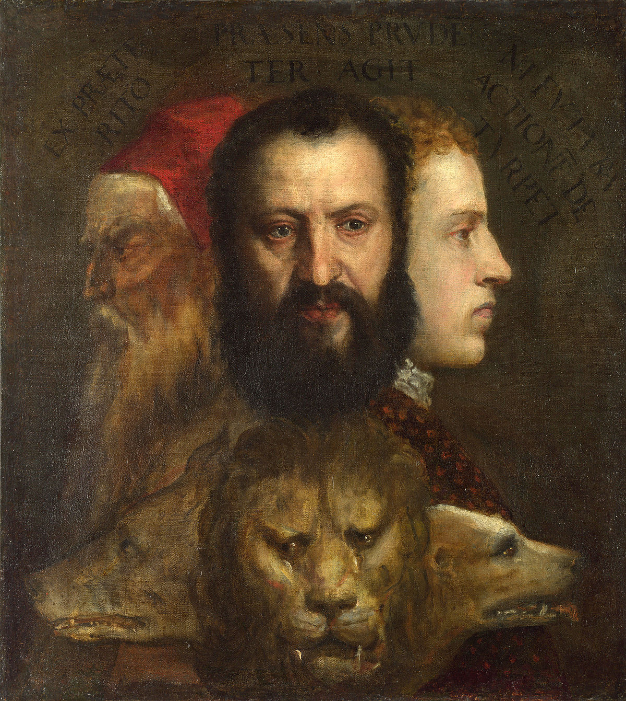

## The Allegory of Prudence

> The greatest enemy of any ambitious man is time for its the one quantity that remians unknown from birth but discovered upon death.

The artist Titian

One of my favourite paintings for a number of reasons. It contains so many layers
of thought exploring time and the animalistic qualities of man. Let me guide you through.

The Allegory of Prudence a painting by the Titian has a barely visble inscription which says:
> EX PRÆTE/RITO // PRÆSENS PRVDEN/TER AGIT // NI FVTVRA / ACTIONĒ DE/TVRPET

Which in english translates to:

> from the experience of the past, the present acts prudently, lest it spoil future actions

## Layer 1: Time 

A word to the wise to live by. This rather jovial yet pivoting piece of advice conveys the importance that time will have during ones lifespan, which is shown by the triptych of ages (youth,manhood,old age). Interesting Titian actually painted not only himself but those of his family members too. 
With the youngest being his Marco Vecellio, his young cousin and heir. The man represents his son Orazio and finally the old man it a self-potrait (self-reflection) of Titian himself.

 You see the wise gain projections into the future by learning from the experience of those before them. Storytelling back in the ages were a way to convey complex lessons to the young just as we inherit genetic material through generations who have survived their is material knowledge that will be inherited too. The rise of the printing press gave rise to the first industrial revolution and transformed the way in which knowledge/information could be reproduced and consumed.

 ## Layer 2: Multivariance of Man

 Exploring the different identites man takes on during their lifetime 

 ## Layer 3: Mans Animalistic Qualities

Exploring the darker side to man often hidden at times but man possesses a animalistic quality 

(Tbc)