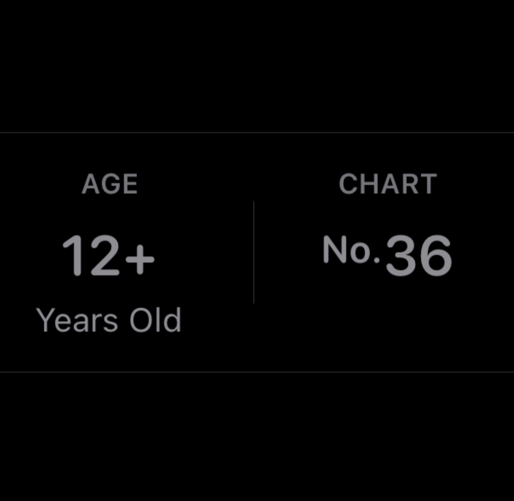

## Charting 

On the 24th of Oct one of the first of many app store charting moments happened. Having peaked around #36 a small scrappy team who are unabashed at sharing they spent £150 was able to see such results we even took on some huge titans like Gauth - subsidiary of bytedance and others.

That type of success really gave the whole team a huge spring of confidence in their steps. So i say a toast to such results and to many more in the future as the next one we look to reaching #1

Salut!