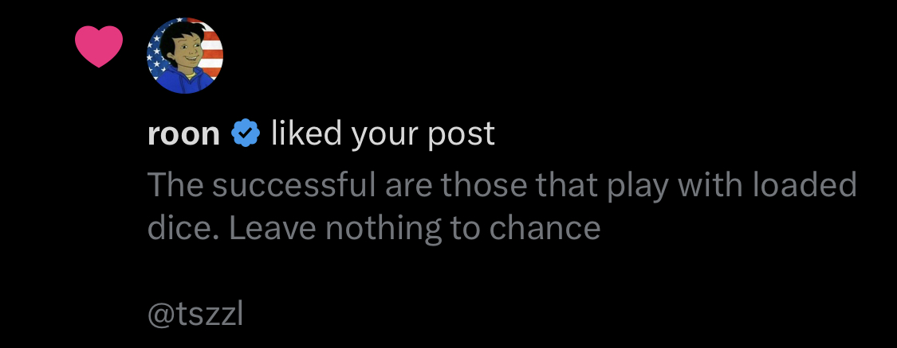

## The Edge

> The successful are those that play with loaded dice. Leave nothing to chance

## No man is born equal

Although a certain group ascribes to the belief that:

> We hold these truths to be self-evident, that all men are created equal, that they are endowed by their creator with certain unalienable Rights, that among these are Life, Liberty and the Pursuit of Happiness.

Benjamin Franklin the author of this quote also belonged to them. This is far from the truth, we're all created unequally. We may share the same organs but our DNA is different, we all have parents but the means to which we were concieved all vary etc.. there are a plethora of conjugate differences I can use as examples for my point. Fundamentally we are all different and the sooner you embrace it the better, use it as your superpower.

## Creating your own luck

Therefore we must create our own luck, every individual should at the very least think and talk confidently about yourself even when you develop a name for yourself.
