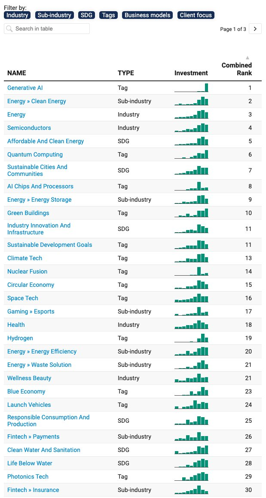

---

title: "Q4 2023 Report"
descriptiion: "My inaugrual quarterly reporting, taking a look at both the macro and micro trends observed so far and future predictions"
publishDate: "01 Oct 2023"
tags: ["report","2023","Q4"]
draft: false 

---

## Q4 2023 Report

_Exploring both the macro and micro trends of the last quarter of the year for 2023_

## Macro

- Tech:

    Although there has been a slow down in PE funds raising deal flow most notably for Gen AI/Clean Energy/Energy/Semiconductors.

    Speaking on the GenAI or AI in general there's a global arms race politically to achieve AGI(though I speculate OpenAI have made headwind on this already) and then ASI. Arguably it's being treated as security threat due to mainly the irrational fears due to the unknown dangers created by Hollywood hysteria that AI could pose a threat to human intelligence.

    

    Ultimately this "hysteria" does have advantages as it is a driver for innovation on a global scale, requiring the best minds currently to work relentlessy to solve the challenges of AI. Will create a notion for the incumbents to spend more which in turn will create job vacanies although very niche, further boosting the skills gap in the labour markets. Counterintuitive as fundamental services such as food, health and education... are yet to be truly distupted but it is these backbone workers of society who will then go on to feel the brunt of the proverbial sword of wage stagnation.

- Global Economy:

    Globally there is a downturn throughout most markets except Japan(who needs no explanation as their stock market for years has just been falsely propped up). Despite wage increases in most developed countries, inflation still remains too high and interest rates are increasing putting many at risk of losing their mortgage, living pay check to pay check and a number of people are defaulting on credit cards. Yet still consumer appetite has remain somewhat unchanged for the common man. Although some of the super rich have become evermore reclusive with many wealthy chinese immigrants returning back to China leaving the states.

    The formation of the BRICS (Brazil, Russia, India, China and South Africa) will add some incredible stats about the trade, land vol etc...
    Most importantly: "Tackling financial and economic issues like reforms at the World Bank and IMF" which is speak of attempts to challenge the dominance of the world reserve currency that is the greenback 

    Middle east is still going ahead with ambitous projects MBS is building the new mega city in the Saudi Arabian peninsula called the "Neom" 
    Saudi has also has been on a cultural shopping spree acquiring football talent and more all in a attempt to diversify the countries economy.

    Europe

- Local Economy (US&UK)
- Political 
- Social movements  

## Micro

- TBD